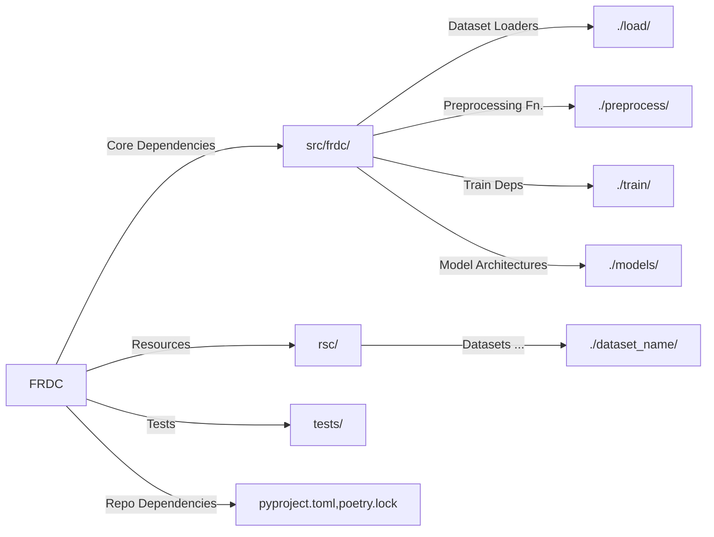

# Getting Started

> Want to use a Dev Container? See [Get Started with Dev Containers](Get-Started-with-Dev-Containers.md)

<procedure title="Installing the Dev. Environment" id="install">
    <step>Ensure that you have the right version of Python.
        The required Python version can be seen in <code>pyproject.toml</code>
        <code-block lang="ini">
            [tool.poetry.dependencies]
            python = "..."
        </code-block>
    </step>
    <step>Start by cloning our repository.
        <code-block lang="shell">
          git clone https://github.com/FR-DC/FRDC-ML.git
        </code-block>
    </step>
    <step>Then, create a Python Virtual Env <code>pyvenv</code>
        <tabs>
        <tab title="Windows">
          <code-block lang="shell">python -m venv venv/</code-block>
        </tab>
        <tab title="Linux">
          <code-block lang="shell">python3 -m venv venv/</code-block>
        </tab>
        </tabs> 
    </step>
    <step>
        <a href="https://python-poetry.org/docs/">Install Poetry</a>
        Then check if it's installed with
        <code-block lang="shell">poetry --version</code-block>
        <warning>
        If <code>poetry</code> is not found, it's likely not in the user PATH.
        </warning>
    </step>
    <step>Activate the virtual environment
        <tabs>
        <tab title="Windows">
        <code-block lang="shell">
            cd venv/Scripts
            activate
            cd ../..
        </code-block>
        </tab>
        <tab title="Linux">
        <code-block lang="shell">
            source venv/bin/activate
        </code-block>
        </tab>
        </tabs> 
    </step>
    <step>Install the dependencies. You should be in the same directory as
        <code>pyproject.toml</code>
        <code-block lang="shell">
            poetry install --with dev
        </code-block>
    </step>
    <step>Install Pre-Commit Hooks
        <code-block lang="shell">
            pre-commit install
        </code-block>
    </step>
</procedure>


<procedure title="Setting Up Google Cloud" id="gcloud">
    <step>
        We use Google Cloud to store our datasets. To set up Google Cloud,
        <a href="https://cloud.google.com/sdk/docs/install">
          install the Google Cloud CLI
        </a>
    </step>
    <step>
        Then,
        <a href="https://cloud.google.com/sdk/docs/initializing">
          authenticate your account
        </a>.
        <code-block lang="shell">gcloud auth login</code-block>
    </step>
    <step>
        Finally, 
        <a href="https://cloud.google.com/docs/authentication/provide-credentials-adc">
          set up Application Default Credentials (ADC)
        </a>.
        <code-block lang="shell">gcloud auth application-default login</code-block>
    </step>
    <step>
        To make sure everything is working, <a anchor="tests">run the tests</a>.
    </step>
</procedure>

<procedure title="Setting Up Label Studio" id="ls">
    <tip>This is only necessary if any task requires Label Studio annotations</tip>
    <step>
        We use Label Studio to annotate our datasets.
        We won't go through how to install Label Studio, for contributors, it
        should be up on <code>localhost:8080</code>.
    </step>
    <step>
        Then, retrieve your own API key from Label Studio.
        <a href="http://localhost:8080/user/account"> Go to your account page </a>
        and copy the API key. <br/></step>
    <step> Set your API key as an environment variable.
        <tabs>
<tab title="Windows">
        In Windows, go to "Edit environment variables for
        your account" and add this as a new environment variable with name
        <code>LABEL_STUDIO_API_KEY</code>.
</tab>
<tab title="Linux">
        Export it as an environment variable.
        <code-block lang="shell">export LABEL_STUDIO_API_KEY=...</code-block>
</tab>
</tabs>
    </step>
</procedure>

<procedure title="Setting Up Weight and Biases" id="wandb">
    <step>
        We use W&B to track our experiments. To set up W&B,
        <a href="https://docs.wandb.ai/quickstart">
          install the W&B CLI
        </a>
    </step>
    <step>
        Then, 
        <a href="https://docs.wandb.ai/quickstart">
          authenticate your account
        </a>.
        <code-block lang="shell">wandb login</code-block>
    </step>
</procedure>

<procedure title="Pre-commit Hooks" collapsible="true">
    <note>This is optional but recommended.
    Pre-commit hooks are a way to ensure that your code is formatted correctly.
    This is done by running a series of checks before you commit your code.
    </note>
    <step>
        <code-block lang="shell">
            pre-commit install
        </code-block>
    </step>
</procedure>

<procedure title="Running the Tests" id="tests">
    <step>
        Run the tests to make sure everything is working
        <code-block lang="shell">
            pytest
        </code-block>
    </step>
</procedure>

## Troubleshooting

### ModuleNotFoundError

It's likely that your `src` and `tests` directories are not in `PYTHONPATH`.
To fix this, run the following command:

```shell
export PYTHONPATH=$PYTHONPATH:./src:./tests
```

Or, set it in your IDE, for example, IntelliJ allows setting directories as
**Source Roots**.

### google.auth.exceptions.DefaultCredentialsError

It's likely that you haven't authenticated your Google Cloud account.
See [Setting Up Google Cloud](#gcloud)

### Couldn't connect to Label Studio

Label Studio must be running locally, exposed on `localhost:8080`. Furthermore,
you need to specify the `LABEL_STUDIO_API_KEY` environment variable. See 
[Setting Up Label Studio](#ls)

### Cannot login to W&B

You need to authenticate your W&B account. See [Setting Up Weight and Biases](#wandb)
If you're facing difficulties, set the `WANDB_MODE` environment variable to `offline`
to disable W&B.

## Our Repository Structure

Before starting development, take a look at our repository structure. This will
help you understand where to put your code.



src/frdc/
: Source Code for our package. These are the unit components of our pipeline.

rsc/
: Resources. These are usually cached datasets

tests/
: PyTest tests. These are unit, integration, and model tests.

### Unit, Integration, and Pipeline Tests

We have 3 types of tests:

- Unit Tests are usually small, single function tests.
- Integration Tests are larger tests that tests a mock pipeline.
- Model Tests are the true production pipeline tests that will generate a
  model.

### Where Should I contribute?

<deflist>
<def title="Changing a small component">
If you're changing a small component, such as a argument for preprocessing,
a new model architecture, or a new configuration for a dataset, take a look
at the <code>src/frdc/</code> directory.
</def>
<def title="Adding a test">
By adding a new component, you'll need to add a new test. Take a look at the
<code>tests/</code> directory.
</def>
<def title="Changing the model pipeline">
If you're a ML Researcher, you'll probably be changing the pipeline. Take a
look at the <code>tests/model_tests/</code> directory.
</def>
<def title="Adding a dependency">
If you're adding a new dependency, use <code>poetry add PACKAGE</code> and
commit the changes to <code>pyproject.toml</code> and <code>poetry.lock</code>.
<note>
    E.g. Adding <code>numpy</code> is the same as 
    <code>poetry add numpy</code>
</note>
</def>
</deflist>