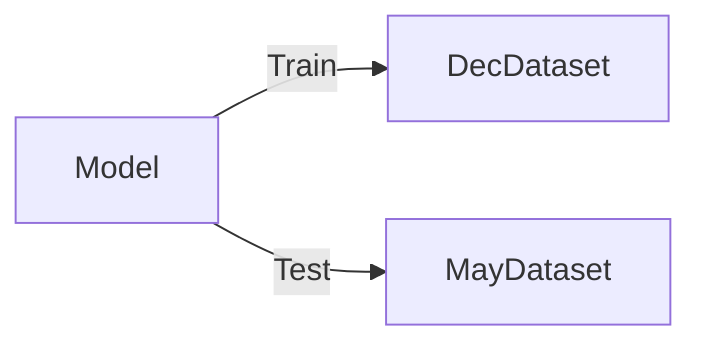
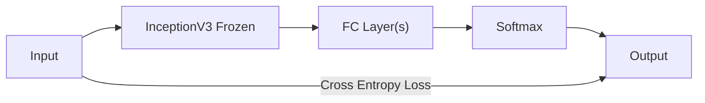
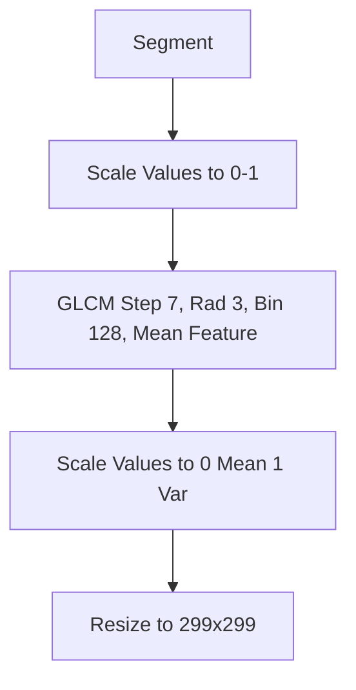
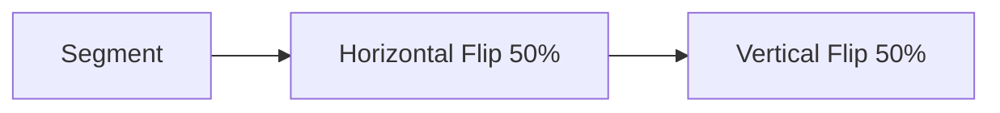

# Model Test Chestnut May-Dec

This test is used to evaluate the model performance on the Chestnut Nature Park
May & December dataset.

See this script in <code>pipeline/model_tests/chestnut_dec_may/main.py</code>.

## Motivation

The usage of this model will be to classify trees in unseen datasets under
different conditions. In this test, we'll evaluate it under a different season.

A caveat is that it'll be evaluated on the same set of trees, so it's not a
representative of a field-test. However, given difficulties of yielding
datasets, this still gives us a good preliminary idea of how the model will
perform in different conditions.

## Methodology

We simply train on the December dataset, and test on the May dataset.

> The inverse of this test is also plausible.

> Ideally, we should have a Validation set to tune the hyperparameters, but
> given the limitations of the dataset, we'll skip this step.
> {style='warning'}

## Model

The current Model used is a simple InceptionV3 Transfer Learning model, with
the last layer replaced with a fully connected layer(s).

> We didn't find significant evidence of improvements of using a more complex
> FC layer, so multiple or single FC layer are feasible.

## Preprocessing

We perform the following steps:

> We need to scale to 0-1 before GLCM, so that GLCM can bin the values
> correctly.

### Augmentation

The following augmentations are used:

> This only operates on training data.

## Hyperparameters

The following hyperparameters are used:

- Optimizer: Adam
- Learning Rate: 1e-3
- Batch Size: 5
- Epochs: 100
- Early Stopping: 4

## Results

We yield around 40% accuracy on the test set, compared to around 65% for the
training set. Raising the training accuracy with a more complex model may
improve the test accuracy, however, due to instability of our test
results, we can't be sure of this.

### Result Images {collapsible="true"}

<tabs>
<tab title="Training Graph">

</tab>
<tab title="Confusion Matrix">

</tab>
</tabs>

### Caveats

- The test set is very small, so the results are not very representative.
- The test set is the same set of trees, so it's not a true test of the model
  performance in different conditions.
- There are many classes with 1 sample, so the model may not be able to learn
  the features of these classes well.
 