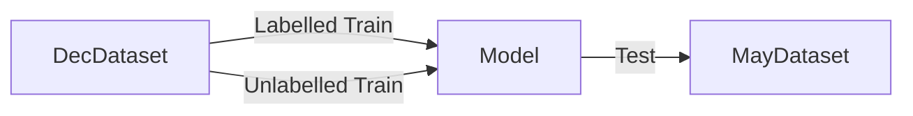
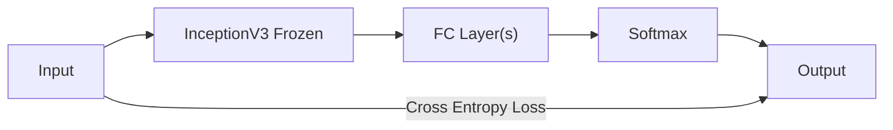
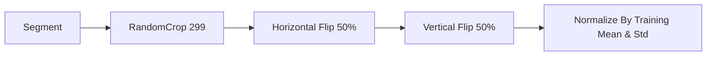
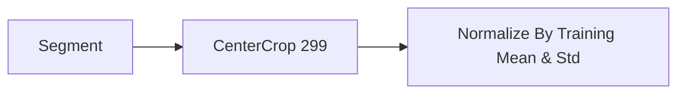
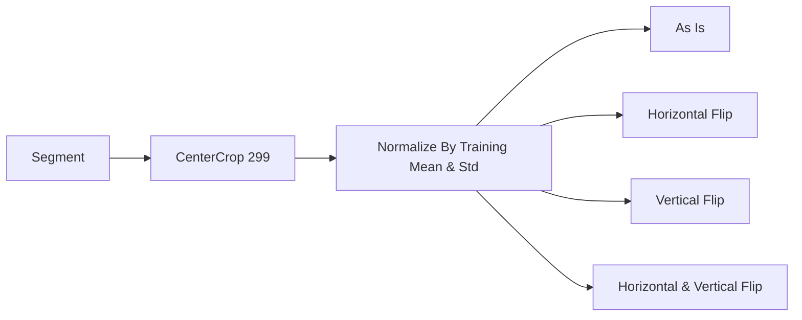

# Model Test Chestnut May-Dec

This test is used to evaluate the model performance on the Chestnut Nature Park
May & December dataset.

See this script in <code>model_tests/chestnut_dec_may/train.py</code>.

## Motivation

The usage of this model will be to classify trees in unseen datasets under
different conditions. In this test, we'll evaluate it under a different season.

A caveat is that it'll be evaluated on the same set of trees, so it's not a
representative of a field-test. However, given difficulties of yielding
datasets, this still gives us a good preliminary idea of how the model will
perform in different conditions.

## Methodology

We train on the December dataset, and test on the May dataset.

Despite not having any true unlabelled data, we use [MixMatch](mix-match.md) 
by treating the labelled data of the December dataset as unlabelled data.

> Ideally, we should have a Validation set to tune the hyperparameters, but
> given the limitations of the dataset, we'll skip this step.
> {style='warning'}

## Model

The current Model used is a simple InceptionV3 Transfer Learning model, with
the last layer replaced with a fully connected layer(s).

> We didn't find significant evidence of improvements of using a more complex
> FC layer, so multiple or single FC layer are feasible.

## Preprocessing

For Training:

For Validation:

For Evaluation:

For evaluation, we evaluate that the model should be invariant to horizontal
and vertical flips, as well as the original image.

## Hyperparameters

The following hyperparameters are used:

- Optimizer: Adam
- Learning Rate: 1e-3
- Batch Size: 32
- Epochs: 10
- Train Iterations: 25~100
- Validation Iterations: 10~25
- Early Stopping: 4

## Results

We evaluate around 40% accuracy on the test set, compared to 100% for the
training set. This indicates that the model has saturated and is not able to
learn anymore from the training set. There's no indication of overfitting as
the validation loss just plateaus.

[W&B Dashboard](https://wandb.ai/frdc/FRDC-ML-tests_model_tests_chestnut_dec_may)

### Caveats

- The test set is very small, so the results are not very representative.
- The test set is the same set of trees, so it's not a true test of the model
  performance in different conditions.
- There are many classes with 1 sample, so the model may not be able to learn
  the features of these classes well.
 