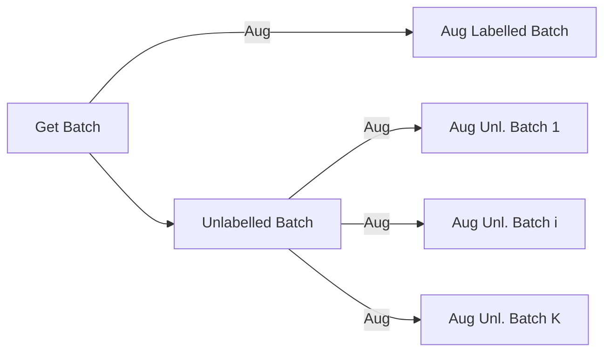
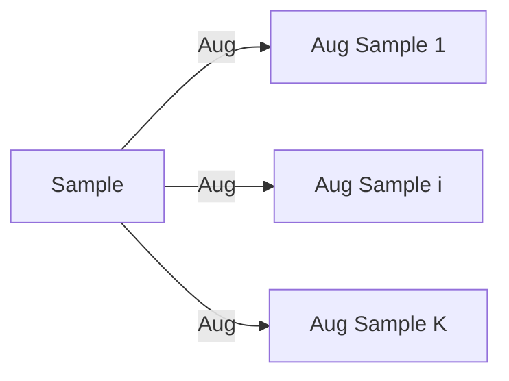

# Custom K-Aug Dataloaders

In MixMatch, implementing the data loading methods is quite unconventional. 

1) We need to load multiple augmented versions of the same image into the same batch.
2) The labelled set is usually too small, causing a premature end to the epoch 
   as it runs out of samples to draw from faster than the unlabelled set.

This can be rather tricky to implement in PyTorch. This tutorial will illustrate how we did it.

## Loading Multiple Augmented Versions of the Same Image

See: `frdc/load/dataset.py` `FRDCDataset.__getitem__`

In MixMatch, a single train batch must consist of:

1. A batch of labeled images
2. K batches of unlabeled images



Keep in mind that the unlabelled batch, is a single batch of images, not 
separate draws of batches. It is then "duplicated" K times, and each copy is
augmented differently.

### Solution 1: Custom Dataset

To solve this, we need to understand the role of both a 
[Dataset](https://pytorch.org/docs/stable/data.html#torch.utils.data.Dataset)
and a
[DataLoader](https://pytorch.org/docs/stable/data.html#torch.utils.data.DataLoader).

- A `Dataset` represents a collection of data, responsible for loading and 
returning something.
- A `DataLoader` draws samples from a Dataset and returns 
batched samples.

The key here is that a `Dataset` is not limited to returning 1 sample at a 
time, we can make it return the K augmented versions of the same image.



In code, this is done by subclassing the `Dataset` class and overriding the
`__getitem__` method.

```python
def duplicate(x):
    return x, deepcopy(x), deepcopy(x)

class AugmentedDataset(Dataset):
    def __init__(self, dataset, aug=duplicate):
        self.dataset = dataset
        self.aug = aug

    def __getitem__(self, index):
        x, y = self.dataset[index]
        return self.aug(x), y
```

In the above example, we have a `Dataset` that returns 3 duplicate versions of
the same image. By leveraging this technique, we can create a `Dataset` that
returns K augmented versions of the same image as a tuple

## Premature End of Epoch due to Small Labelled Set

See: `frdc/train/frdc_datamodule.py`

In MixMatch, the definition of an "epoch" is a bit different. Instead of
implying that we have seen all the data once, it implies that we've drawn
`N` batches. The `N` is referred to as the number of iterations per epoch.

Take for example, a labelled set of numbers [1, 2, 3] and an unlabelled set
[4, 5, 6, 7, 8, 9, 10]. With batch size of 2, we'll run out of labelled samples
after 2 iterations, but we'll still have 3 more iterations for the unlabelled
set.

- Draw 1: [1, 2], [4, 5]
- Draw 2: [3], [6, 7].
- Epoch ends.

### Solution 2: Random Sampling

To fix this, instead of sequentially sampling the labelled set (and the
unlabelled set), we can sample them randomly. This way, we can ensure that
it never runs out.

- Draw 1: [1, 3], [7, 5]
- Draw 2: [2, 1], [4, 9]
- Draw 3: [3, 2], [8, 6]
- ... and so on.

Luckily, PyTorch's `DataLoader` supports random sampling. We just need to use
`RandomSampler` instead of `SequentialSampler` (which is the default).

```python
from torch.utils.data import DataLoader, RandomSampler

dl = DataLoader(
    dataset,
    sampler=RandomSampler(
        dataset,
        num_samples=batch_size * train_iters,
        replacement=False,
    )
)
```

This will ensure that the "epoch" ends when we've drawn `train_iters` batches

