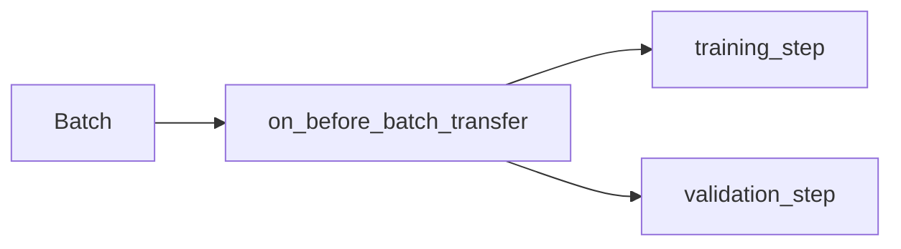
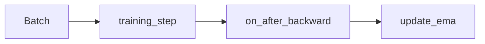
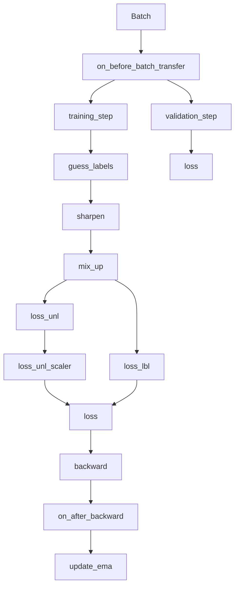

# MixMatch Module

See `frdc/train/mixmatch_module.py`.

## Quick Recap 

We will go over the essential parts of the code here. Before that, we revise
some of the concepts that are used in the code.

### Abstract Methods

In Python, we can define abstract methods using the `abc` module.
Just like other OOP languages, abstract methods are methods that must be
implemented by the child class.

For example:

```python
from abc import ABC, abstractmethod


class MyAbstractClass(ABC):
    @abstractmethod
    def my_abstract_method(self):
        pass


class MyChildClass(MyAbstractClass):
    def my_abstract_method(self):
        print("Hello World!")
```

### `nn.Module` & `LightningModule`

If you're unfamiliar with PyTorch, you should read the
[nn.Module Documentation](https://pytorch.org/docs/stable/generated/torch.nn.Module.html).

`nn.Module` is the base class for all neural network modules in PyTorch.
While `LightningModule` is a PyTorch Lightning class that extends `nn.Module`,
providing it with additional functionality that reduces boilerplate code.

By implementing it as a `LightningModule`, we also enter the PyTorch Lightning
ecosystem, which provides us with a lot of useful features such as logging,
early stopping, and more.

#### What do we implement in a Module?

One key component that `nn.Module` requires, is the model. So for example:

```python
class MyModule(nn.Module):
    def __init__(self):
        super().__init__()
        self.model = nn.Sequential(
            nn.Linear(28 * 28, 128),
            nn.ReLU(),
            nn.Linear(128, 10),
        )

    def forward(self, x):
        return self.model(x)
```

PyTorch Lightning builds on top of it, requiring `training_step` and
`validation_step`. Each "step" is a batch of data, and the model is trained
on it. So for example:

```python
class MyModule(LightningModule):
    def __init__(self): ...

    def forward(self, x): ...

    def training_step(self, batch, batch_idx):
        x, y = batch
        y_hat = self(x)
        loss = F.cross_entropy(y_hat, y)
        return loss

    def validation_step(self, batch, batch_idx):
        x, y = batch
        y_hat = self(x)
        loss = F.cross_entropy(y_hat, y)
        return loss
```

Usually, the training and validation steps are the same, but in some cases,
such as MixMatch, they are different. In MixMatch, we not only use a different
loss function for train, we also handle a batch differently. The PyTorch
Lightning framework allows us to separate the two, and implement them
separately.

### Model Embedded Preprocessing `on_before_batch_transfer`

In PyTorch Lightning, we can also inject a step before the batch is passed to
the model. This is done by overriding the `on_before_batch_transfer` method.



> `before` means it is done before the batch is transferred to the GPU

This allows us to do preprocessing on the batch, such as scaling the data,
encoding the labels, and more.

### Custom EMA Update `on_after_backward`

We also leverage another hook, called `on_after_backward`. This hook is called
after the backward pass, and allows us to do custom operations. In our case,
we use it to update the EMA model.



## MixMatch

We recommend having `tests/model_tests/chestnut_dec_may/train.py` open while
reading this section. It implements a real-world example of MixMatch.

As a summary:

1) We learned what is an abstract method, and how to implement it
2) We implement the model in `LightningModule` much like we would
   in `nn.Module`
3) We implement `on_before_batch_transfer` to preprocess the batch
4) Finally, we implement `on_after_backward` to update the EMA model

With the above in mind, let's look at the MixMatch implementation.
<deflist>
<def title="forward (abstract)">
    <p>Forward pass of the model</p>
</def>
<def title="ema_model (abstract)">
   <p>
      The model that is used for EMA. We expect this property to be implemented
      by the child class.
   </p>
</def>
<def title="update_ema (abstract)">
   <p>
      The method to update the EMA model. We expect this method to be
      implemented by the child class.
   </p>
</def>
<def title="loss_unl_scaler (static)">
   <p>
      Takes in the current progress of the training, 0.0 to 1.0, where
      0.0 is the start of the training, and 1.0 is the end.
      Then, returns the multiplier for the unlabeled loss.
   </p>
</def>
<def title="loss_lbl (static)">
   <p>
      Implements the loss for labeled data. Takes in the predicted labels
      and the ground truth labels, and returns the loss. This is cross entropy
      for MixMatch.
   </p>
</def>
<def title="loss_unl (static)">
   <p>
      Implements the loss for unlabeled data. Takes in the predicted labels
      and the ground truth labels, and returns the loss. This is MSE for
      MixMatch.
   </p>
</def>
<def title="mixup">
   <p>
      Takes in the data and the labels, the beta distribution parameter, 
      and returns the mixed data and labels.
   </p>
</def>
<def title="sharpen">
   <p>
      Takes in the labels and temperature, and returns the sharpened labels.
   </p>
</def>
<def title="guess_labels">
   <p>
      Takes in the unlabeled data, and returns the guessed labels.
   </p>
</def>
<def title="progress">
    <p>
        The current progress of the training, 0.0 to 1.0, where
        0.0 is the start of the training, and 1.0 is the end.
    </p>
</def>
<def title="training_step">
    <p>
        The training step runs through 1 batch of data, and returns the loss.
        Note that this is significantly different from validation step, as
        we handle the K-Augmented data differently.
    </p>
</def>
<def title="test / validation_step">
    <p>
        The test / validation step runs through 1 batch of data, and returns 
        the loss.
    </p>
</def>
<def title="predict_step">
    <p>
        The predict step runs through 1 batch of data, and returns the actual
        decoded labels.
    </p>
</def>
<def title="on_after_backward">
    <p>
        The on_after_backward hook is called after the backward pass, and
        allows us to do custom operations. In our case, we use it to update
        the EMA model.
    </p>
</def>
<def title="on_before_batch_transfer">
    <p>
        The on_before_batch_transfer hook is called before the batch is
        transferred to the GPU. In our case, we use it to preprocess the
        batch.
    </p>
</def>
</deflist>

A diagram of how these components interact with each other is shown below:


Finally, we show an example of how to use the MixMatch module:

```python
from sklearn.preprocessing import StandardScaler, OrdinalEncoder

from frdc.train.mixmatch_module import MixMatchModule

ss = StandardScaler()
ss.fit(X_train)
oe = OrdinalEncoder(
   handle_unknown="use_encoded_value",
   unknown_value=np.nan,
)
oe.fit(y_train)

MixMatchModule(
   x_scaler=ss,
   y_encoder=oe,
   n_classes=10,
   sharpen_temp=0.5,
   mix_beta_alpha=0.75,
)
```

In particular, we need to supply some transformations for the preprocessing
step. In this case, we use `StandardScaler` to scale the data, and
`OrdinalEncoder` to encode the labels.

1) It's best if standardization is done only on the training data, and not the
validation data to better fit real-world scenarios.
2) We use `OrdinalEncoder` as it handles unseen labels. So if a class doesn't
show up in the training data, it will be encoded as `np.nan`, and will not 
participate in the loss calculation.

> Due to the nature of how we handle unseen labels, the performance can be 
> an overestimate. This is because the model will not be penalized for
> misclassifying unseen labels.
{style='warning'}

## Design Choices

### Static Method Overriding

We implement many functions as static, as we believe that a functional
style reduces dependencies, thus making the code easier to test and debug.

Furthermore, it allows the subclasses to easily override the functions, to
customize the behavior of the MixMatch module.

For example, the `loss_unl_scaler` function is static, thus, we can implement
our own scaling function, and pass it to the MixMatch module.

```python
def my_loss_unl_scaler(progress: float) -> float:
    return progress ** 2
    
class MyMixMatchModule(MixMatchModule):
    @staticmethod
    def loss_unl_scaler(progress: float) -> float:
        return my_loss_unl_scaler(progress)
```

If we had used a method instead, we would have to consider instance state,
which would make it harder to override.

### Why not use Dataclasses?

One of the biggest caveats of `nn.Module` is that it
requires `super().__init__()`
to be called before anything is assigned. While `dataclass` can leverage
`__post_init__` to do the same, we felt that this was too much of a hassle
to save a few keystrokes. Thus, we opted to use `__init__` instead, while more
verbose, it is more explicit.

### Why use PyTorch Lightning?

While we did hit some road blocks implementing SSL, due to its complex and
unconventional nature, we felt that the benefits of using PyTorch Lightning
outweighed the cons.

`on_before_batch_transfer` and `on_after_backward` are unconventional
hooks, and we had to do some digging to find them. It can be argued that
by just writing explicit code, we can avoid the need for these hooks, but
the PyTorch ecosystem fixes many other issues, so we closed an eye on this.
 

## References

- [YU1ut's PyTorch Implementation](https://github.com/YU1ut/MixMatch-pytorch/tree/master)
- [Google Research's TensorFlow Implementation](https://github.com/google-research/mixmatch)
