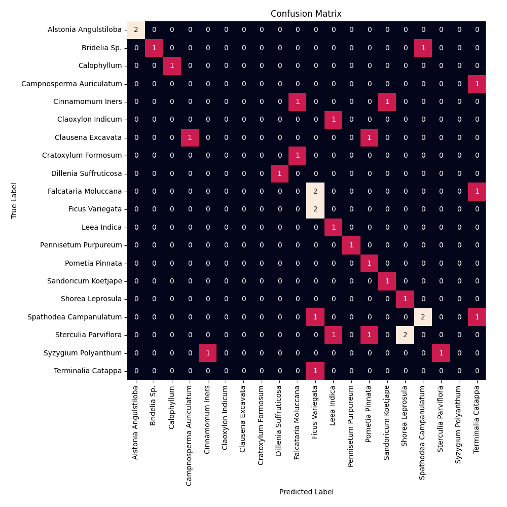

# Model Tests

This directory contains full tests model architectures.

## `chestnut_dec_may`

This test is the classic FRDC tests used in research papers.
It uses December's data to train and May's data to test.

The current baseline is 40% accuracy.

### Confusion Matrix

